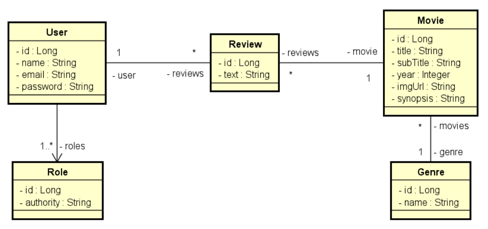

# **Desafio 03 - Curso Java Spring Expert: Módulo 04**
### Enunciado
Implemente as funcionalidades necessárias para que os testes do projeto passem

### Modelo de Domínio

### Casos de Uso
- **Listar filmes**
  1. [OUT] O sistema apresenta uma listagem dos nomes de todos gêneros, bem como
uma listagem paginada com título, subtítulo, ano e imagem dos filmes, ordenada
alfabeticamente por título.
  2. [IN] O usuário visitante ou membro seleciona, opcionalmente, um gênero.
  3. [OUT] O sistema apresenta a listagem atualizada, restringindo somente ao gênero
selecionado.
- **Visualizar detalhes do filme**
  1. [IN] O usuário visitante ou membro seleciona um filme
  2. [OUT] O sistema informa título, subtítulo, ano, imagem e sinopse do filme, e também
uma listagem dos textos das avaliações daquele filme juntamente com nome do usuário
que fez cada avaliação.
  3. [IN] O usuário membro informa, opcionalmente, um texto para avaliação do filme.
  4. [OUT] O sistema apresenta os dados atualizados, já aparecendo também a avaliação
feita pelo usuário.
- **Exceção iii.i - Texto vazio**
  - iii.i.i. O sistema apresenta uma mensagem de que não é permitido texto vazio na
avaliação.

### Critérios de Correção
- GET /genres deve retornar 401 para token inválido;
- GET /genres deve retonar 200 com todos gêneros para VISITOR logado;
- GET /genres deve retonar 200 com todos gêneros para MEMBER logado;
- GET /movies/{id} deve retornar 401 para token inválido;
- GET /movies/{id} deve retornar 200 com o filme para VISITOR logado;
- GET /movies/{id} deve retornar 200 com o filme para MEMBER logado;
- GET /movies/{id} deve retornar 404 para id inexistente;
- GET /movies deve retornar 401 para token inválido;
- GET /movies deve retornar 200 com página ordenada de filmes para VISITOR logado;
- GET /movies deve retornar 200 com página ordenada de filmes para MEMBER logado;
- GET /movies?genreId={id} deve retornar 200 com página ordenada de filmes filtrados por gênero;
- POST /reviews deve retornar 401 para token inválido;
- POST /reviews deve retornar 403 para VISITOR logado;
- POST /reviews deve retornar 201 com objeto inserido para MEMBER logado e dados válidos;
- POST /reviews deve retornar 422 para MEMBER logado e dados inválidos.

### Competências avaliadas:
- Desenvolvimento TDD de API Rest com Java e Spring Boot;
- Realização de casos de uso;
- Consultas a banco de dados relacional com Spring Data JPA;
- Tratamento de erros com respostas HTTP customizadas;
- Controle de acesso por perfil de usuário e rotas.
